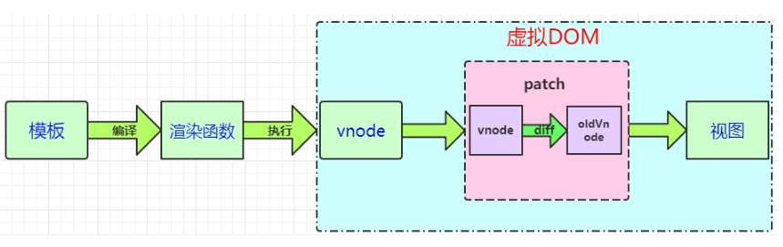
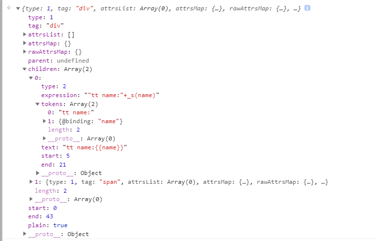

vue 打包出来的脚本是没有 html 模板的，那么vue是怎么渲染模板的呢？



### 模板编译过程

根据vue生命周期可知道，dom节点是在 mount 阶段生成的，那么我们看下代码，通过mount代码我们可以看到，在mount的过程中，如果render函数不存在（render函数存在会优先使用render）会将template进行compileToFunctions得到render以及staticRenderFns。譬如说手写组件时加入了template的情况都会在运行时进行编译。而render function在运行后会返回VNode节点，供页面的渲染以及在update的时候patch。接下来我们来看一下template是如何编译的。

1. 将字符串模板转换成 AST 在计算机科学中，抽象语法树（abstract syntax tree或者缩写为AST），或者语法树（syntax tree），是源代码的抽象语法结构的树状表现形式，这里特指编程语言的源代码。具体可以查看[抽象语法树](https://zh.wikipedia.org/wiki/%E6%8A%BD%E8%B1%A1%E8%AA%9E%E6%B3%95%E6%A8%B9)。在前端领域 语法检查、脚本转换、脚本压缩等都场景下广泛应用

2. AST 会经过 generate 得到 render 函数，render的返回值是VNode，VNode是Vue的虚拟DOM节点

#### 切换版本
vue 2.0 后，vue 的版本分为 运行时版本和完整版本。
- 完整版：同时包含编译器和运行时的版本。

- 编译器：用来将模板字符串编译成为 JavaScript 渲染函数的代码。

- 运行时：用来创建 Vue 实例、渲染并处理虚拟 DOM 等的代码。基本上就是除去编译器的其它一切。
 
vue cli 因为使用的单文件组件，所以默认是使用运行时版本，所以我们切换成完整版本
```javascript
module.exports = {
    configureWebpack: {
        resolve: {
            alias: {
                'vue$': 'vue/dist/vue.esm.js'
            }
        }
    }
}
```

### compileToFunctions 
11970
```javascript
var ref = compileToFunctions(template, {
    outputSourceRange: process.env.NODE_ENV !== 'production',
    shouldDecodeNewlines: shouldDecodeNewlines,
    shouldDecodeNewlinesForHref: shouldDecodeNewlinesForHref,
    delimiters: options.delimiters,
    comments: options.comments
}, this);
var render = ref.render;
var staticRenderFns = ref.staticRenderFns;
options.render = render;
options.staticRenderFns = staticRenderFns;
```
### createCompiler 编译器

createCompiler用以创建编译器，返回值是compile以及 compileToFunctions （11689）。compile是一个编译器，它会将传入的template转换成对应的AST、render函数以及staticRenderFns函数。而compileToFunctions则是带缓存的编译器，避免模板重复编译，同时staticRenderFns以及render函数会被转换成Funtion对象。

在进入compileToFunctions以后，会先检查缓存中是否有已经编译好的结果，如果有结果则直接从缓存中读取。这样做防止每次同样的模板都要进行重复的编译工作。

11865 createCompilerCreator 构造器有下面两个阶段

#### parse：Convert HTML string to AST 

`'<div>tt name:{{name}}</div>>'`


节点上有许多数据代表这个节点的形态。

性能优化：optimize，optimize的主要作用是标记static静态节点，这是Vue在编译过程中的一处优化，后面当update更新界面时，会有一个patch的过程，diff算法会直接跳过静态节点，从而减少了比较的过程，优化了patch的性能。

#### generate
10961
generate是将AST转化成render funtion字符串的过程，得到结果是render的字符串以及staticRenderFns字符串。
`'<div>tt name:{{name}}</div>>'` 生成的 render function 字符串：

"with(this){return _c('div',[_v("tt name:"+_s(name)),_c('span',[_v("xxx")])])}"

render 函数返回的是 vnode

看了render function字符串，发现有大量的_c，_v，_s，_q，这些函数究竟是什么？ RenderHelpers

```javascript
/*处理v-once的渲染函数*/
  Vue.prototype._o = markOnce
  /*将字符串转化为数字，如果转换失败会返回原字符串*/
  Vue.prototype._n = toNumber
  /*将val转化成字符串*/
  Vue.prototype._s = toString
  /*处理v-for列表渲染*/
  Vue.prototype._l = renderList
  /*处理slot的渲染*/
  Vue.prototype._t = renderSlot
  /*检测两个变量是否相等*/
  Vue.prototype._q = looseEqual
  /*检测arr数组中是否包含与val变量相等的项*/
  Vue.prototype._i = looseIndexOf
  /*处理static树的渲染*/
  Vue.prototype._m = renderStatic
  /*处理filters*/
  Vue.prototype._f = resolveFilter
  /*从config配置中检查eventKeyCode是否存在*/
  Vue.prototype._k = checkKeyCodes
  /*合并v-bind指令到VNode中*/
  Vue.prototype._b = bindObjectProps
  /*创建一个文本节点*/
  Vue.prototype._v = createTextVNode
  /*创建一个空VNode节点*/
  Vue.prototype._e = createEmptyVNode
  /*处理ScopedSlots*/
  Vue.prototype._u = resolveScopedSlots

  /*创建VNode节点*/
  vm._c = (a, b, c, d) => createElement(vm, a, b, c, d, false)
```

通过这些函数，render函数最后会返回一个VNode节点，在_update的时候，经过patch与之前的VNode节点进行比较，得出差异后将这些差异渲染到真实的DOM上。

#### DOM操作

由于Vue使用了虚拟DOM，所以虚拟DOM可以在任何支持JavaScript语言的平台上操作，譬如说目前Vue支持的浏览器平台或是weex，在虚拟DOM的实现上是一致的。那么最后虚拟DOM如何映射到真实的DOM节点上呢？

Vue为平台做了一层适配层，浏览器平台见[/platforms/web/runtime/node-ops.js]，创建 Element 元素等方法，以及weex平台见[/platforms/weex/runtime/node-ops.js]。不同平台之间通过适配层对外提供相同的接口，虚拟DOM进行操作真实DOM节点的时候，只需要调用这些适配层的接口即可，而内部实现则不需要关心，它会根据平台的改变而改变。

现在又出现了一个问题，我们只是将虚拟DOM映射成了真实的DOM。那如何给这些DOM加入attr、class、style等DOM属性呢？

这要依赖于虚拟DOM的生命钩子。虚拟DOM提供了如下的钩子函数(5822)，分别在不同的时期会进行调用。

同理，也会根据不同平台有自己不同的实现，我们这里以Web平台为例。Web平台的钩子函数见[/platforms/web/runtime/modules]。里面有对attr、class、props、events、style以及transition（过渡状态）的DOM属性进行操作。