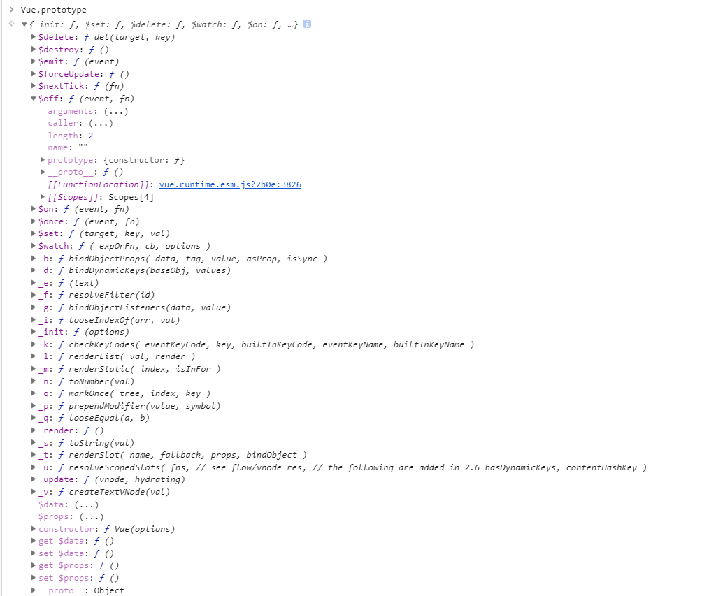

0. 构建 Vue 对象流程

```javascript
function Vue (options) {
  if (process.env.NODE_ENV !== 'production' &&
    !(this instanceof Vue)) {
    warn('Vue is a constructor and should be called with the `new` keyword')
  }
  /*初始化*/
  this._init(options)
}
initMixin(Vue)
stateMixin(Vue)
eventsMixin(Vue)
lifecycleMixin(Vue)
renderMixin(Vue)
```
初始化生命周期 添加 $on $once $set $watch $nextTick _render 等方法


在调用 `initGlobalAPI` 初始化 Vue.use Vue.mixin Vue.extend component directive filter


1. 数据
数据响应式依赖于 Object.defineProperty ,文件 state.js

```javascript
export function proxy (target: Object, sourceKey: string, key: string) {
  sharedPropertyDefinition.get = function proxyGetter () {
    return this[sourceKey][key]
  }
  sharedPropertyDefinition.set = function proxySetter (val) {
    this[sourceKey][key] = val
  }
  Object.defineProperty(target, key, sharedPropertyDefinition)
}
proxy(vm, `_data`, key)
```

将data的值都存在 vm._data 中，然后监听 vm._data 的属性变化，比如 
那么获取 this.age 的时候执行的就是 
```javascript
sharedPropertyDefinition.get = function proxyGetter () {
    return this['_data']['age']
  }
```

设置值的时候 this.age = 99 就是执行
```javascript
sharedPropertyDefinition.set = function proxySetter (val) {
    this['_data']['age'] = 10
  }
```

监听完成后，将数据加到观察队列中 observe ，用于依赖收集和调度更新 `observe(data, true /* asRootData */)` 这个需要详细  Watcher 观察监听者  Dep 依赖收集器 defineReactive

- 发布订阅模式

重点：数据的收集和更新！

2. 函数
`vm[key] = typeof methods[key] !== 'function' ? noop : bind(methods[key], vm)` 将函数的作用域绑定到当前的 VueComponent 中


### 虚拟dom

### diff 算法理解

### dom 异步更新策略
用 Promise 将dom更新的回调事件加入到 microtask 队列中，已达到异步更新，如果短时间内频繁的更新试图，会出现性能消耗

### 事件 emit on off once
vm._events 对象存储 on 监听的事件 
```javascript
(vm._events[event] || (vm._events[event] = [])).push(fn)
```

$once 执行一次，便销毁
```javascript
function on () {
  vm.$off(event, on)
  fn.apply(vm, arguments)
}
on.fn = fn
vm.$on(event, on)
```

$emit 从vm._events 获取事件，若是数组就循环执行里面的方法
`invokeWithErrorHandling`


### 父子组件通讯方式

父向子组件通讯：
1. 参数传递 props
2. 使用[$children](https://cn.vuejs.org/v2/api/#vm-children)可以在父组件中访问子组件。

子组件向父组件通讯
1. 使用自定义事件
父组件向子组件传递事件方法，子组件通过$emit触发事件，回调给父组件，父组件 on 监听事件

2. 修改父组件传给子组件的 props 对象，因为对象是传引用，但是不建议这么修改

3. 使用 $parent 访问父组件

4. 依赖注入 provide inject ，父组件provide 提供子组件需要的方法，子组件通过 inject 获取方法

跨组件通讯
1. 自己实现一个事件总线，通过 $on $emit 传递事件
2. 复杂的系统使用 vuex 管理全局状态

### 渲染函数 JSX
对于非单文件组件，可以使用 template 定义模板，或者自定义 render 函数
```javascript
// 为了弥补缺少的实例
// 提供第二个参数作为上下文
render: function (createElement, context) {
  // ...
  return createElement('h1', {prop:''}) // 返回 VNODE
}
```

自定义 render 函数适用一些无状态组件（没有响应式数据）函数式组件，例如vue高阶组件的实现
```javascript
Vue.component('my-component', {
  functional: true,
  // Props 是可选的
  props: {
    // ...
  },
  // 为了弥补缺少的实例
  // 提供第二个参数作为上下文
  render: function (createElement, context) {
    // ...
    return createElement()
  }
})
```